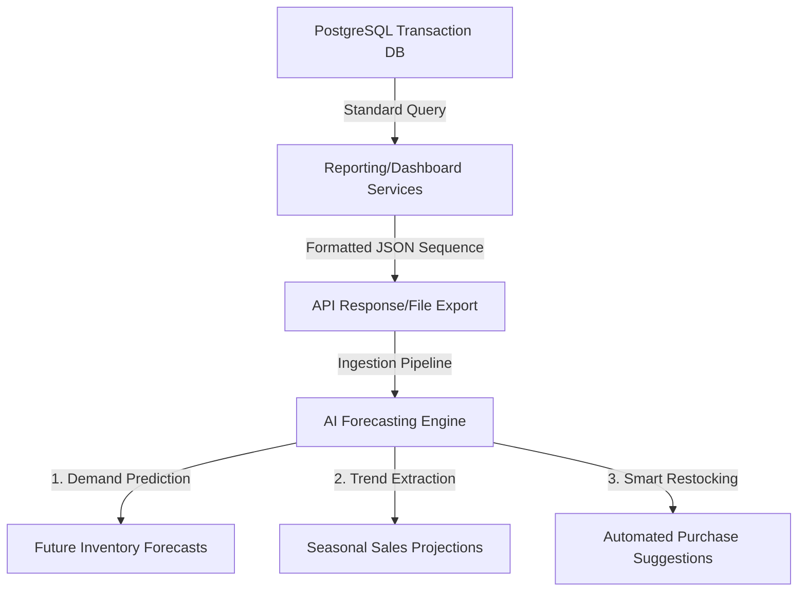

# Analytics Foundation, Database Optimization & Future AI Pipelines

This document details the production-grade architectural design for the B2B Analytics Foundation, caching strategies, aggregation rules, optimized folder layout, and future-ready AI ingestion pipelines for the Aroma-B2B application.

---

## 1. Analytics & Database Aggregation Foundation

To maintain high responsiveness in a growing multi-tenant B2B SaaS platform, historical reports must be isolated from standard OLTP database operations to avoid locking transactional tables.

### Aggregation & Precomputation Design
- **Live Computations**: Today's metrics (sales today, revenue today, active inventory counts, current low-stock status) are computed live. Live queries utilize simple, indexed filters.
- **Precomputed Calculations**: Historical metrics (weekly/monthly summaries, margins, profit charts, spending patterns) are precomputed and frozen at the end of each business day.

### Suggested Precomputation Schema (Prisma)
We recommend adding the following analytics schemas to `schema.prisma` to offload complex analytical queries:

```prisma
model DailyShopMetrics {
  id               String   @id @default(uuid())
  shopId           String
  shop             Shop     @relation(fields: [shopId], references: [id], onDelete: Cascade)
  date             DateTime // Frozen Date (YYYY-MM-DD)
  totalSalesCount  Int      @default(0)
  totalRevenue     Float    @default(0.00)
  costOfGoodsSold  Float    @default(0.00)
  netProfit        Float    @default(0.00)
  totalPurchases   Int      @default(0)
  purchaseExpenses Float    @default(0.00)
  createdAt        DateTime @default(now())

  @@unique([shopId, date])
  @@index([shopId, date])
}

model DailyProductPerformance {
  id           String   @id @default(uuid())
  productId    String
  product      Product  @relation(fields: [productId], references: [id], onDelete: Cascade)
  date         DateTime
  quantitySold Float    @default(0.00)
  revenue      Float    @default(0.00)

  @@unique([productId, date])
  @@index([productId, date])
}
```

### Nightly Cron Job Pipeline
A cron job (scheduled via node-cron or serverless triggers at 11:59 PM in the local timezone) performs the daily consolidation:
1. Queries the day's total transactions, sales items, cost calculations, and purchases for each active shop.
2. Writes the metrics to `DailyShopMetrics` and `DailyProductPerformance` tables.
3. Once written, historical queries simply pull single-row lookups from these precomputed tables instead of calculating averages over millions of transaction records.

---

## 2. Security & Performance Optimization Techniques

### Caching Strategy
- **Layer 1: Redis / In-Memory Cache**:
  - Live dashboard homepages utilize a 5-minute cache wrapper.
  - Write-through invalidation: Cache keys for `dashboard:summary:<shopId>` are deleted immediately when a new sale check-out is successfully committed, ensuring real-time dashboard accuracy when it counts, but offloading 99% of idle page-refresh traffic.
- **Layer 2: Response Compression**:
  - Integrate `compression` middleware in Express to deflate JSON reports before transfer.

### Database Indexing Strategy (PostgreSQL)
Ensure the following indexes are defined in your database to accelerate the Prisma query paths:

```sql
-- 1. Index for sales queries (highly optimized for recent transactions and date aggregations)
CREATE INDEX idx_sales_shop_created ON "Sale" ("shopId", "createdAt" DESC);

-- 2. Index for purchase tracking and spending trends
CREATE INDEX idx_purchases_shop_created ON "Purchase" ("shopId", "createdAt" DESC);

-- 3. Multi-column index for inventory low-stock alerts
CREATE INDEX idx_products_stock_alert ON "Product" ("shopId", "isActive", "currentStock", "minimumStock");

-- 4. Index for checking blacklisted login tokens
CREATE INDEX idx_blacklist_token ON "BlackList" ("token");
```

---

## 3. Modular Production Folder Structure

To scale as a robust, professional SaaS application, we recommend organizing components by business domain using the following structured layout:

```
aroma-b2b/
├── app.js                   # Application Configuration
├── server.js                # Server Listener Entrypoint
├── db/
│   └── db.js                # Prisma Connection Pool Instantiator
├── prisma/
│   └── schema.prisma        # Database Modeling Definitions
├── middleware/
│   ├── authMiddleware.js    # JWT & RBAC Access Protection
│   ├── validate.js          # Unified Schema Validating Orchestrator
│   └── multer.js            # Image Ingestion Controller
├── utils/
│   └── helpers.js           # Reusable Utility Functions
├── routes/
│   ├── authRoute.js         # /api/v1/auth
│   ├── usersRoute.js        # /api/v1/users
│   ├── shopRoute.js         # /api/v1/shops
│   ├── productRoute.js      # /api/v1/products
│   ├── dashboard.routes.js  # /api/v1/dashboard
│   └── report.routes.js     # /api/v1/reports
├── controllers/
│   ├── authController.js
│   ├── usersController.js
│   ├── shopController.js
│   ├── productController.js
│   ├── dashboard.controller.js
│   └── report.controller.js
├── services/
│   ├── authService.js
│   ├── userService.js
│   ├── shopService.js
│   ├── productService.js
│   ├── dashboard.service.js # Aggregations for Homepage Widgets
│   └── report.service.js    # BI Financial and Stock Intelligence
└── analytics/
    ├── jobs/
    │   └── precompute.cron.js # Daily Precomputations Execution Pipeline
    └── pipelines/
        └── aiInference.js    # Formatted Ingestions for AI Engines
```

---

## 4. Future AI Integration Design

Our new service structures output temporal sequences (e.g. daily sales totals, cost records, and transaction ratios) in JSON format. This prepares the backend for future AI integrations:



### Ingestion Data Structure (AI-Ready Format)
All daily timelines output sequential formats perfectly tailored for AI libraries (such as pandas, TensorFlow, or Facebook Prophet):
```json
[
  { "date": "2026-05-24", "revenue": 1250.45 },
  { "date": "2026-05-25", "revenue": 1420.10 },
  { "date": "2026-05-26", "revenue": 1100.80 }
]
```

### Implementing AI Use Cases
1. **Demand Prediction & Inventory Forecasting**: Feed the 30-day/365-day sequential output of `getSalesChart` or the `DailyProductPerformance` metrics into a forecasting model (like ARIMA or Prophet) to project next month's sales curves.
2. **Automated Restock Suggestions**: Match the AI projected inventory demand curves against current levels (`currentStock`) and lead-times to calculate auto-recommended restock quantities.
3. **Recommendation Systems**: Use `getFastMovingProducts` and `getTopProducts` lists in combination with user transaction arrays to calculate item association weights (e.g. Apriori algorithm) for co-purchasing suggestions.
4. **Seasonal Trends Identification**: Use yearly summaries (`getSalesSummary(interval: 'yearly')`) to track year-over-year fluctuations and match peak seasons to business metrics.
